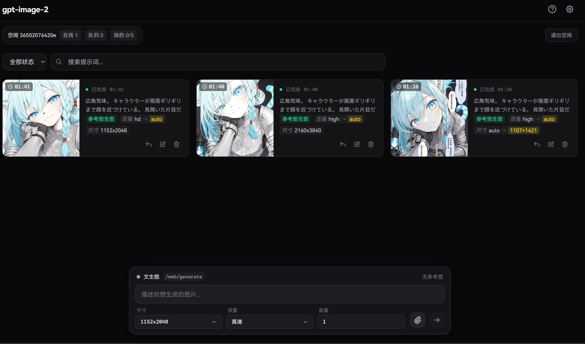
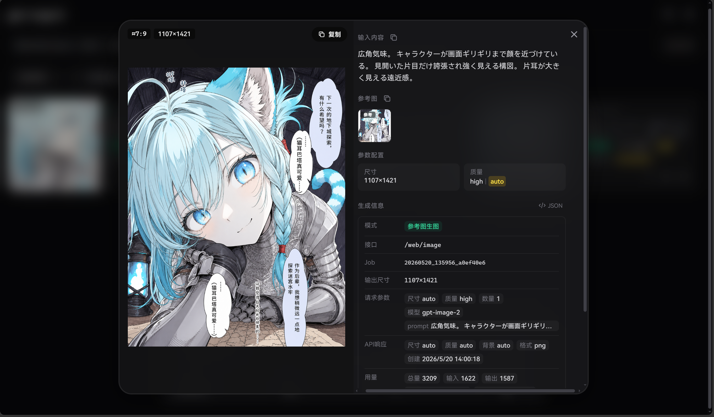
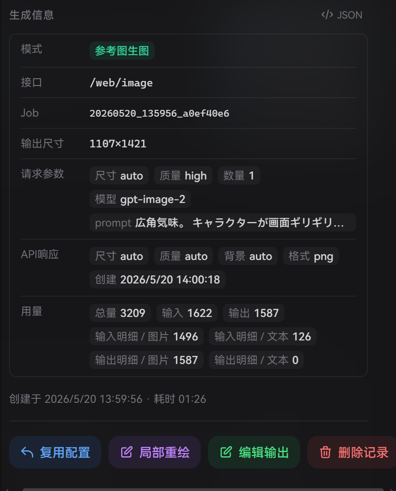
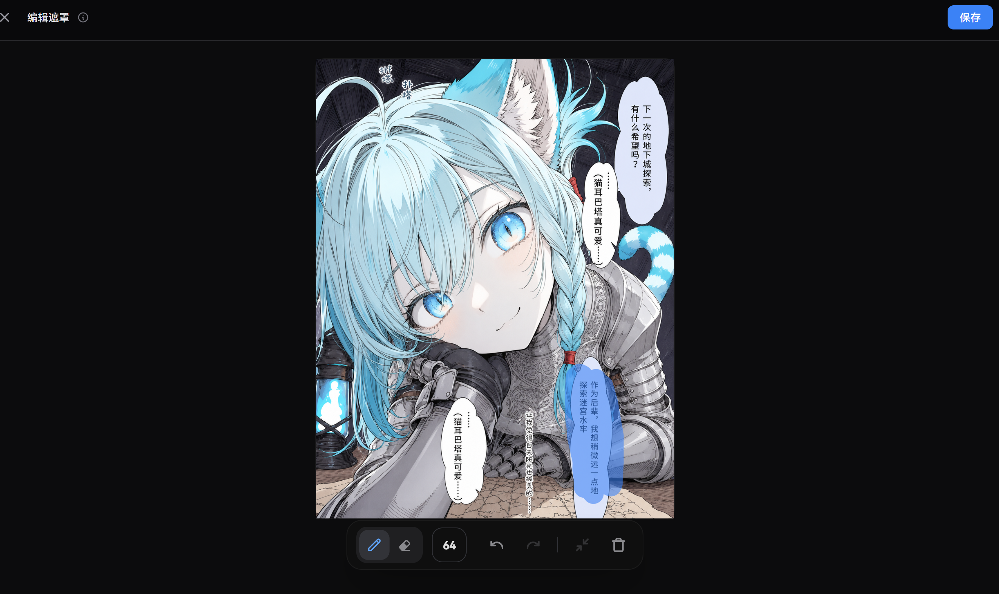

# image-playground

基于 [CookSleep/gpt_image_playground](https://github.com/CookSleep/gpt_image_playground) 改造的多用户图片生成与编辑服务。

在原项目纯前端架构基础上，增加了 FastAPI 后端、多用户空间隔离、管理后台、服务端历史记录、运行时配置等功能。

## 与原项目的主要区别

- 新增 FastAPI 后端，统一管理 API Key，用户无需自备
- 上游配置放在管理后台，API Key 仅管理员可写且不会明文回显
- 口令空间隔离，多用户共享同一实例
- 服务端图片存储 + 历史记录持久化
- 管理控制台（仪表盘、任务管理、图库、空间主管理、运行时配置）
- 并发控制（每用户生成上限可动态调整）
- 遮罩编辑与参考图在详情中可回溯查看
- 详情页解析请求参数、API 实际响应、token 用量和原始 JSON，便于排查不同上游的行为差异

## 目录结构

```
image-playground/
├── backend/          # FastAPI 后端
│   ├── app.py        # 主服务
│   ├── db.py         # SQLite 数据层
│   ├── requirements.txt
│   ├── run_local.sh
│   ├── start_screen.sh
│   └── stop_screen.sh
├── frontend/         # React 前端
│   ├── src/
│   ├── package.json
│   └── dist/         # 构建产物（被后端静态服务）
├── docs/
│   └── img/          # README 截图
├── .env.example
├── API.md
├── start.bat        # Windows 一键启动脚本
└── README.md
```

## 功能

- `/` 用户 Web UI（口令空间隔离）
- `ADMIN_PAGE_PATH` 管理控制台
- `POST /api/v1/generate` 文生图 API
- `POST /api/v1/edit` 图片编辑 API
- SQLite 审计日志
- 本地图片存储 + 缩略图

## 界面预览

### 多用户工作台与服务端历史

首页不再只是本地前端状态，而是带空间口令、在线/队列统计、服务端历史、搜索和任务状态。卡片会展示请求参数与 API 实际返回参数的差异，例如 `quality high -> auto`、`size auto -> 1107x1421`。



### 任务详情与参数追踪

详情页可以回看输入内容、参考图、请求参数、API 响应参数、实际输出尺寸、token 用量和原始 JSON。这里主要用于对比不同上游服务的实际执行结果，排查尺寸、质量、格式等参数是否被上游改写。



<p align="center">
  
</p>

### 遮罩编辑与局部重绘

输出图可以直接进入遮罩编辑，配合画笔、橡皮、笔刷大小、撤销/重做和保存，用于继续走局部重绘流程。



## 快速开始

Windows 一键启动：

```bat
start.bat
```

脚本会检查依赖、构建前端，并在当前终端启动后端。如果端口已被占用，会询问是否关闭旧进程。

```bash
cp .env.example .env
# 编辑 .env 填入服务器启动配置；上游 API Key 进管理后台配置

cd backend
python3 -m venv .venv
.venv/bin/pip install -r requirements.txt
bash run_local.sh
```

前端开发：

```bash
cd frontend
npm install
npm run dev
```

前端构建（后端会自动从 `frontend/dist/` 提供静态文件）：

```bash
cd frontend
npm run build
```

## 环境变量

`.env` 只负责服务器配置，例如启动密钥、端口、Cookie 安全开关、请求超时和口令长度。上游 provider 单独保存在后端数据库里，请登录管理后台，在「系统 / 上游配置」里维护；API Key 只允许管理员写入，接口不会明文回显。

```env
OWNER_SECRET=replace-with-a-long-secret
COOKIE_SIGNING_SECRET=replace-with-another-long-secret
ADMIN_PASSWORD=replace-with-admin-password
ADMIN_PAGE_PATH=/admin
PORT=30116
IMAGE_API_TIMEOUT=360
MIN_WEB_PASSPHRASE_LENGTH=6
COOKIE_SECURE=0
```

管理后台上游配置支持 `id`、名称、OpenAI-compatible `base_url`、API Key、默认模型、模型列表和参数白名单。参数不在白名单内会直接报错，不会自动降级。

## API

详见 `API.md`。

## 致谢

本项目基于 [CookSleep/gpt_image_playground](https://github.com/CookSleep/gpt_image_playground) 开发，感谢原作者的优秀工作。

## 许可证

[MIT License](LICENSE)
